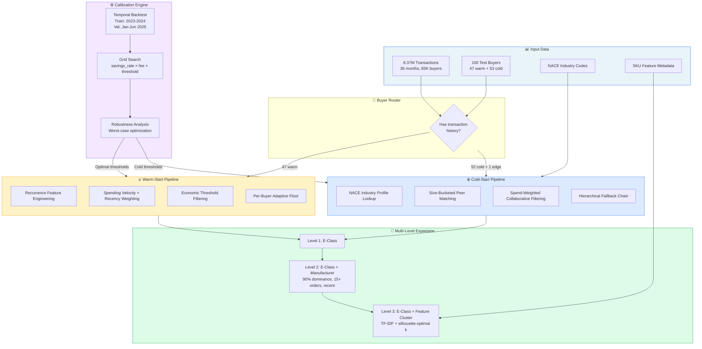
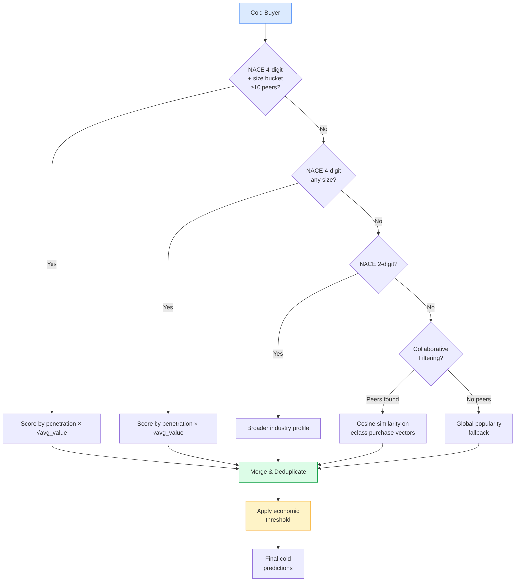
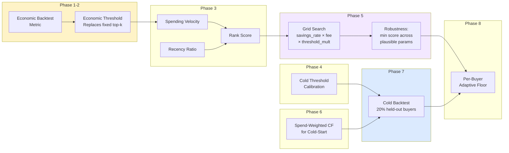
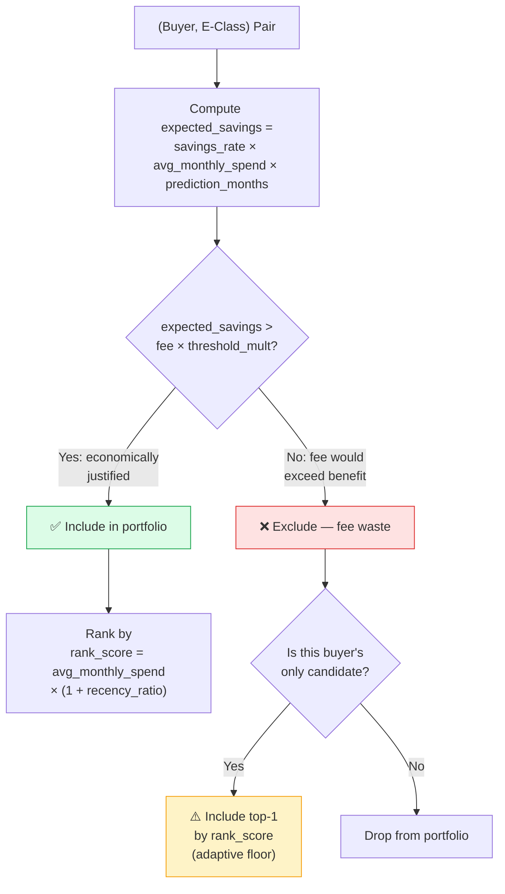
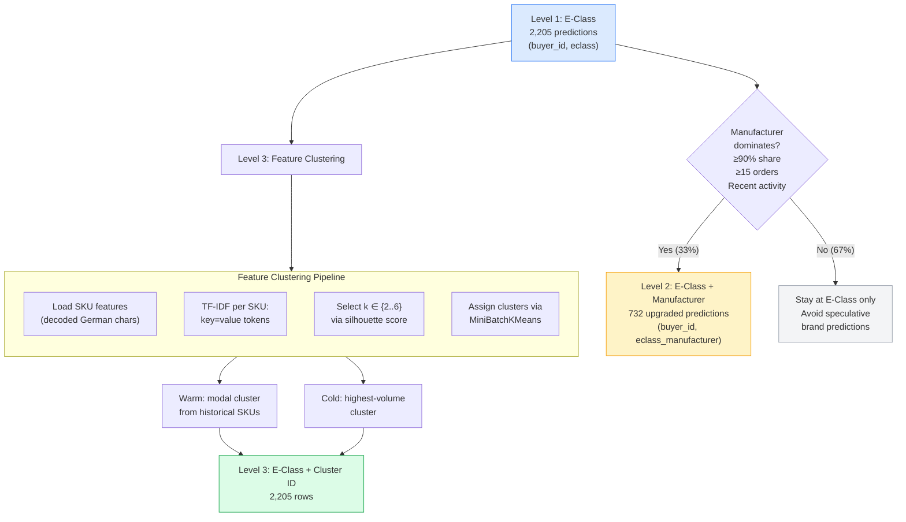
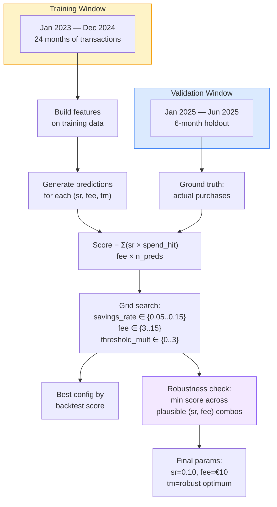

# Core Demand Prediction Engine

**An economically calibrated system for predicting recurring enterprise procurement demand, maximizing net savings under fee constraints.**

> 🏆 **#1 on Level 1 leaderboard** at the end of the hackathon — built through disciplined economic modeling, not through overfitting or hyperparameter tricks.

---

## Why This Problem Matters

Enterprise procurement is dominated by the **long tail**: hundreds of one-off purchases that generate noise, obscure patterns, and waste analyst time. Buried inside that long tail is a much smaller set of **core demand** — product categories a buyer purchases repeatedly, predictably, and with real economic value.

Identifying core demand unlocks procurement automation, contract negotiation leverage, and supplier consolidation. But the prediction problem is constrained: **every prediction incurs a fixed monthly fee**. Predict too many categories and the fees erode all savings. Predict too few and you miss consolidation opportunities.

This is not a recommendation problem. This is a **portfolio optimization problem under asymmetric cost**.

---

## The Economic Objective

$$\text{Score} = \sum_{i \in \text{hits}} \text{Savings}_i \;-\; \sum_{j \in \text{all predictions}} \text{Fee}_j$$

Where savings scale approximately as $\sqrt{\text{price}} \times \text{frequency}$ for correctly predicted categories, and each prediction incurs a fixed fee regardless of correctness.

**Key implication:** Precision matters more than recall. Every false positive costs money directly. The system must be *economically disciplined*, not just statistically accurate.

---

## Key Results

| Metric | Value |
|--------|-------|
| **Level 1 Leaderboard** | **#1** |
| Warm-start backtest precision | 92.8% (1,297 / 1,397) |
| Total predictions | 2,205 across 100 buyers |
| Warm buyers served | 47 (+ 1 edge case → cold fallback) |
| Cold buyers served | 52 |
| Level 2 upgrade rate | 33% of L1 predictions |
| Robustness | Optimized for worst-case across plausible scoring parameters |

---

## Architecture Overview



---

## Warm-Start vs Cold-Start Strategy

The 100 test buyers split into two fundamentally different problems:

### Warm-Start (47 buyers)
Buyers with 2+ years of transaction history. The signal is **purchase recurrence**: categories bought across many distinct calendar months represent stable, ongoing demand.

**Features per (buyer, E-Class) pair:**
- `n_months_active` — distinct months with purchases
- `n_months_recent` — activity in last 6 months (Jan–Jun 2025)
- `n_months_weighted` — recent months weighted 2× to capture *ongoing* vs *stale* demand
- `avg_monthly_spend` — spending velocity in the recent window
- `recency_ratio` — recent spend / total spend
- `rank_score` — composite signal: `avg_monthly_spend × (1 + recency_ratio)`

**Decision rule:** Include a prediction if:
$$\text{savings\_rate} \times \text{expected\_spend} > \text{fee} \times \text{threshold\_mult}$$

This replaces a naive top-k cutoff with an *economically motivated threshold*: only predict categories where expected savings exceed expected cost.

### Cold-Start (52 buyers + 1 edge case)
Buyers with zero transaction history. Predictions rely entirely on industry signals and peer behavior.

**5-level hierarchical fallback:**



**Conservative portfolio:** 15 E-Classes per cold buyer (vs ~30 for warm). With zero history, the risk of fee waste is higher, so the system is deliberately selective.

---

## End-to-End Pipeline



The pipeline runs 8 phases sequentially, each addressing a specific aspect of the economic optimization:

| Phase | Purpose | Key Insight |
|-------|---------|-------------|
| 1 | Economic backtest metric | Score = savings - fees, not accuracy |
| 2 | Economic threshold | Dynamic inclusion based on expected savings vs fee |
| 3 | Spending velocity ranking | Recent spending rate + recency ratio as ranking signal |
| 4 | Cold-start economic threshold | Same fee-aware logic applied to industry profiles |
| 5 | Full grid search | Sweep over (savings_rate, fee, threshold_mult) space |
| 6 | Spend-weighted CF | Collaborative filtering using log1p(spend) weights on recurring purchases |
| 7 | Cold-start backtest | Hold out 20% of known buyers to validate cold logic |
| 8 | Per-buyer adaptive floor | Every warm buyer gets ≥1 prediction even below threshold |

---

## Economic Decision Logic



### Why Overprediction Hurts


Savings exhibit diminishing returns (high-value categories are captured first), while fees grow linearly with prediction count. The optimal portfolio size is where marginal savings equal marginal fees — which the economic threshold naturally discovers.

---

## Level 1 → Level 2 → Level 3 Expansion



**Level 2 philosophy:** Manufacturer specificity is only added when evidence is overwhelming. A 90% dominance threshold with 15+ orders and recent activity ensures the manufacturer prediction reflects actual procurement behavior, not historical accident.

**Level 3 philosophy:** SKU-level features are noisy (suppliers change, catalogs evolve), but *functional need* is stable. TF-IDF clustering captures "nitrile gloves size L" vs "nitrile gloves size M" as distinct demand patterns, even as specific product codes change across contracts.

---

## Backtesting & Calibration



**Robustness analysis:** The true scoring formula's parameters (savings rate, fee) are partially opaque. Rather than optimizing for a single assumed (sr, fee) pair, the system evaluates each threshold across a *plausible range* of parameters and selects the threshold that maximizes the **worst-case** score. This guards against overfitting to incorrect assumptions about the scoring function.

**Cold-start backtest:** 20% of known training buyers are held out as simulated cold-start buyers. Industry profiles are built from the remaining 80%, and cold predictions are evaluated against the held-out buyers' actual purchasing behavior. This provides direct evidence that the cold-start strategy generalizes.

---

## Why This Approach Won on Level 1

1. **Economic framing, not accuracy framing.** The system directly optimizes for net savings minus fees, not precision/recall/F1. This aligns the model with the actual objective.

2. **Recurrence as the primary signal.** Categories bought across 6+ distinct months are almost certain to continue. This signal has 92.8% precision — far better than ML-based prediction alone.

3. **Robustness over point optimization.** Instead of tuning to one assumed scoring formula, the system optimizes for worst-case performance across plausible parameters.

4. **Portfolio discipline.** Conservative cold-start portfolios (15 items), strict manufacturer thresholds (90% dominance), and economic cutoffs prevent fee waste.

5. **Spending velocity ranking.** Recent spending rate, not just historical volume, determines which categories to prioritize — capturing demand shifts.

6. **Adaptive fallbacks.** Per-buyer floors, hierarchical NACE lookups, and CF blending ensure every buyer gets reasonable predictions even with sparse data.

---

## Project Structure

```
core-demand-hackathon/
├── README.md                              # This file
├── report.md                              # Concise methodology report
├── requirements.txt                       # Python dependencies
├── optimize_v4.py                         # Production pipeline (8-phase system)
├── data_visualization/
│   ├── visualise.py                       # 5 analytical figures
│   ├── fig1_long_tail_core_demand.png     # Pareto curve + long tail analysis
│   ├── fig2_dataset_overview.png          # Dataset statistics (4-panel)
│   ├── fig3_recurrence_analysis.png       # Recurrence vs spend patterns
│   ├── fig4_cold_start_industry_profiles.png  # NACE sector demand profiles
│   └── fig5_portfolio_tradeoff.png        # Optimal portfolio size analysis
├── json_approach/
│   ├── v15_surgical.py                    # LightGBM surgical tuning (25 features)
│   └── v17_gameplan.py                    # 3-lever optimization variant
├── docs/
│   ├── architecture.md                    # System architecture deep dive
│   ├── methodology.md                     # Full methodology explanation
│   ├── economic-optimization.md           # Economic reasoning and tradeoffs
│   ├── results.md                         # Results, calibration, and analysis
│   └── interview-notes.md                # CV bullets + interview preparation
├── README_Core_Demand_Challenge.md        # Original challenge specification
└── LICENSE                                # MIT License
```

---

## Reproducibility

### Requirements
```bash
pip install -r requirements.txt
```

### Data Files (not included — competition-provided)
Place in the repo root:
- `plis_training.csv.gz` — 8.37M transactions (tab-separated, UTF-8 BOM, gzipped)
- `customer_test.csv.gz` — 100 test buyers
- `features_per_sku.csv.gz` — SKU-level feature metadata
- `nace_codes.csv.gz` — NACE industry classification codes

### Run
```bash
# Generate Level 1 + Level 2 submissions
python optimize_v4.py

# Generate visualizations
cd data_visualization && python visualise.py
```

### Output
- `submission_lvl1.csv` — Level 1 predictions (buyer_id, predicted_id)
- `submission_lvl2.csv` — Level 2 manufacturer-specific predictions

---

## Visualizations

The visualization suite produces 5 figures that explain the problem structure and solution rationale:

| Figure | What It Shows |
|--------|---------------|
| **Long Tail vs Core Demand** | Pareto curve: ~15-20% of E-Classes account for ~80% of spend |
| **Dataset Overview** | Monthly volume trends, price distributions, NACE sector breakdown |
| **Recurrence Analysis** | Months-active distribution, spend vs recurrence scatter, economic signal comparison |
| **Cold-Start Industry Profiles** | Top E-Classes per NACE sector — the basis for industry-profile predictions |
| **Portfolio Trade-off** | Cumulative savings vs fees vs net score — shows optimal portfolio size |

---

## Limitations

- **Level 2 and Level 3 were not optimized for leaderboard competition** — the primary effort was on Level 1 where the economic impact is largest.
- **Cold-start predictions are inherently lower precision** — industry priors are useful but cannot match buyer-specific transaction history.
- **The true scoring formula was partially opaque** — robustness analysis mitigates this, but the optimal parameters may differ from assumptions.
- **No ensemble of ML models was used** — the winning approach is primarily rule-based (recurrence + economic thresholds), which proved more robust than gradient-boosted models in this setting.
- **SKU-level feature clustering (Level 3)** uses unsupervised methods; cluster quality depends on feature coverage in the source data.

---

## Future Work

- **Industry expansion for warm buyers** — applying cold-start NACE-matching to warm buyers could surface peer-sourced portfolio gaps (categories that similar companies buy but the target buyer doesn't yet).
- **Prediction source SWAP** — when multiple scoring methods disagree, replacing weak predictions with higher-confidence alternatives from collaborative filtering could improve quality without increasing portfolio size.
- **Association rule mining** — co-purchase patterns (buyers who buy X frequently also buy Y) could provide cross-category expansion signals.
- **Temporal cross-validation** — rolling-window backtesting across multiple time periods would strengthen calibration confidence.
- **Per-buyer threshold optimization** — different buyers may have different optimal threshold multipliers based on their purchasing behavior distribution.


---

## License

MIT — see [LICENSE](LICENSE).
