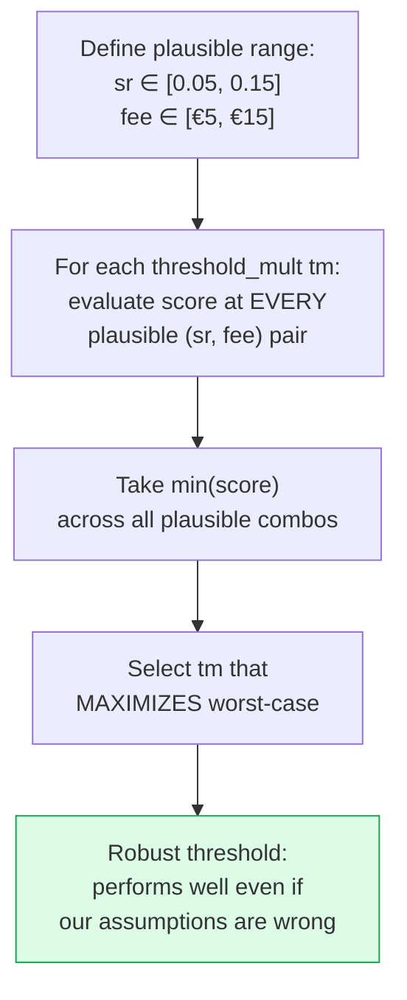
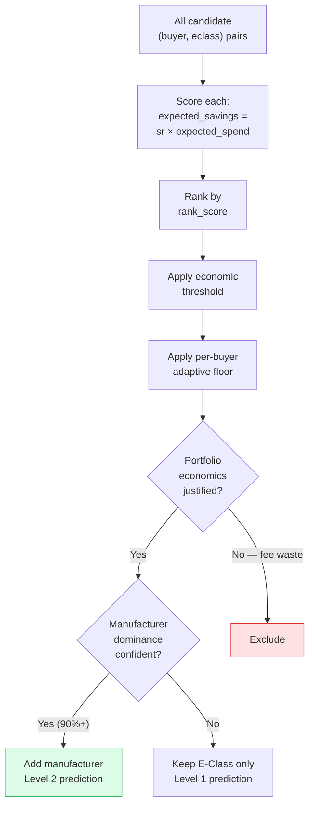

# Economic Optimization

## The Core Constraint

Most recommendation systems optimize for relevance — will the user like this item? This system operates under a fundamentally different constraint: **every prediction costs money**.

$$\text{Net Value} = \underbrace{\sum_{i \in \text{hits}} \text{Savings}_i}_{\text{Revenue from correct predictions}} \;-\; \underbrace{\sum_{j \in \text{all predictions}} \text{Fee}_j}_{\text{Cost of all predictions}}$$

This asymmetry changes everything about system design:
- **Precision dominates recall.** A missed prediction (false negative) is a missed opportunity. An incorrect prediction (false positive) is a direct cost.
- **Portfolio size has a natural optimum.** Adding predictions yields diminishing marginal savings but constant marginal fees.
- **Confidence thresholds must be economically calibrated**, not statistically calibrated.

---

## Why Top-K Fails

A conventional approach would predict the top-K most likely categories per buyer. This is wrong for three reasons:

### 1. Optimal K varies by buyer
A buyer who purchases 50 categories regularly should get more predictions than one who purchases 5. Fixed K either under-serves the first or over-serves the second.

### 2. K ignores economic value
A category purchased once at €10,000 and a category purchased monthly at €50 may have similar recurrence scores but very different economic profiles. The high-value item may justify its fee; the low-value one may not.

### 3. K doesn't degrade gracefully
When K is wrong, it's wrong by a lot. Setting K=30 when the optimum is 15 doubles fees with minimal savings uplift. An economic threshold degrades smoothly — marginal predictions near the threshold add near-zero net value.

---

## The Economic Threshold

Each (buyer, E-Class) candidate is evaluated for inclusion:

$$\text{Include if: } \underbrace{sr \times E[\text{spend}]}_{\text{Expected savings}} > \underbrace{fee \times tm}_{\text{Fee threshold}}$$

Where:
- $sr$ = savings rate (estimated ~10%)
- $E[\text{spend}]$ = expected spend in prediction period = `avg_monthly_spend × months`
- $fee$ = per-prediction monthly fee (estimated ~€10)
- $tm$ = threshold multiplier — the safety margin

**threshold_mult = 1.0** means: include only if expected savings exactly cover the fee.
**threshold_mult = 0.5** means: include if expected savings cover at least half the fee (more aggressive).
**threshold_mult = 2.0** means: require 2× expected savings vs fee (more conservative).

---

## Robustness Under Parameter Uncertainty

The true values of `savings_rate` and `fee` are known approximately but not exactly. Optimizing for a single assumed (sr, fee) pair risks overfitting to wrong assumptions.

### The Robustness Procedure

This is a **minimax strategy**: maximize the minimum outcome. It sacrifices some performance under the most favorable parameter assumptions in exchange for safety under unfavorable ones.

### Why This Matters

| Strategy | If params are favorable | If params are unfavorable |
|----------|------------------------|--------------------------|
| Point optimization | Excellent | Potentially catastrophic |
| Robust optimization | Good | Still good |

For a competition where you submit once and the scoring formula is partially opaque, robustness is strictly preferable.

---

## Cold-Start Economic Reasoning

Cold-start buyers present a different economic calculus:
- **Zero buyer-specific signal** → predictions are based on industry priors, not personal history
- **Lower expected precision** → each prediction is less likely to be correct
- **Same fee structure** → incorrect predictions still cost the same

This justifies a **conservative portfolio**: 15 E-Classes per cold buyer vs ~30 for warm buyers.

The cold economic threshold is calibrated separately (via held-out buyer backtest) because:
1. Cold predictions have different precision characteristics than warm predictions
2. The expected savings per cold prediction are estimated from NACE peer behavior, not from the buyer's own spending
3. Over-predicting for cold buyers is especially wasteful because there's no buyer-specific signal to correct direction

---

## The Portfolio Construction Problem

### Level 2 Economic Reasoning

Adding manufacturer specificity to a prediction is only valuable if:
1. The buyer strongly prefers one manufacturer (≥90% order share)
2. There's enough data to be confident (≥15 orders)
3. The preference is current (recent activity in that manufacturer-eclass pair)

If any of these conditions fail, the manufacturer prediction is speculative — and a wrong manufacturer prediction at Level 2 adds fee without adding savings (since savings come from category-level matching, not manufacturer-level matching).

**Result:** Only 33% of Level 1 predictions are upgraded to Level 2. This is deliberately conservative — every Level 2 prediction must be *highly likely* to be correct.

---

## What Makes This Different From Standard Recommendation

| Dimension | Standard RecSys | This System |
|-----------|----------------|-------------|
| **Objective** | Maximize relevance/engagement | Maximize savings − fees |
| **False positive cost** | Low (user scrolls past) | High (fee incurred) |
| **Portfolio size** | Fixed or unconstrained | Economically optimized |
| **Threshold** | Statistical (P > 0.5) | Economic (savings > fee × margin) |
| **Calibration** | Cross-validation on accuracy | Backtest on economic score |
| **Robustness** | Not typically considered | Central to design |
| **Cold-start** | Content-based filtering | Industry profile + CF blend |
| **Multi-level** | Single prediction type | Category → Manufacturer → Features |
