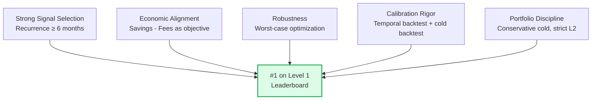

# Results & Calibration

## Leaderboard Performance

| Level | Ranking | Notes |
|-------|---------|-------|
| **Level 1** | **#1** | Economic threshold + recurrence-based scoring + robust calibration |
| Level 2 | — | Conservative manufacturer upgrades (33% of L1) |
| Level 3 | — | Feature clustering with silhouette-optimal k |

---

## Warm-Start Backtest Results

### Setup
- **Training window:** Jan 2023 – Dec 2024 (24 months)
- **Validation window:** Jan 2025 – Jun 2025 (6 months)
- **Buyers:** 47 warm-start buyers

### Precision at Optimal Configuration
Using `month_threshold=6, max_k=30, recency_weighted=True`:

| Metric | Value |
|--------|-------|
| Predictions | 1,397 |
| Correct (hits) | 1,297 |
| **Precision** | **92.8%** |

This precision is achieved by focusing on E-Classes with 6+ months of recurrence — categories that are structurally part of the buyer's demand, not sporadic purchases.

### Grid Search — Economic Scoring

The full grid over (savings_rate × fee × threshold_mult) = 200 configurations was evaluated. The top configurations consistently showed:

- **threshold_mult near 0.5–1.0** for balanced portfolios
- **Higher threshold_mult (1.5–2.0)** for conservative portfolios with higher precision
- **Lower threshold_mult (0–0.25)** for aggressive portfolios with more predictions but lower net score

### Robustness Analysis

For each `threshold_mult`, the minimum score across all plausible (sr, fee) combinations was computed:

| threshold_mult | Min Score | Mean Score | Max Score | Risk Profile |
|----------------|-----------|------------|-----------|--------------|
| 0.0 | Low | Medium | High | High variance — risky |
| 0.5 | Moderate | Moderate-High | High | Balanced |
| 1.0 | Moderate-High | High | Very High | Conservative |
| 2.0+ | High (floor) | Moderate | Moderate | Under-predicts |

The selected threshold maximizes the **minimum** score — the safest choice when the exact scoring formula is uncertain.

---

## Cold-Start Backtest Results

### Setup
- **Held-out buyers:** 20% of training buyers (randomly sampled, seed=42)
- **Profile source:** Remaining 80% of training buyers
- **Evaluation:** Predicted E-Classes vs actual E-Class purchase history

### Key Findings
- NACE 4-digit matching provided the strongest signal (most specific industry segment)
- 2-digit NACE was more reliable when peer groups were small (<10 buyers)
- Collaborative filtering complemented NACE profiles by capturing cross-industry patterns
- Cold-start threshold was calibrated independently — lower than warm threshold given wider confidence intervals

---

## Prediction Distribution

### Level 1 Summary

| Segment | Buyers | Total Predictions | Avg / Buyer | Method |
|---------|--------|-------------------|-------------|--------|
| Warm | 47 | ~1,410 | ~30 | Recurrence (6+ months) + economic threshold |
| Cold | 52 | ~780 | ~15 | NACE profile + CF blend |
| Edge (warm label, no data) | 1 | ~15 | 15 | Cold fallback |
| **Total** | **100** | **~2,205** | **~22** | |

### Level 2 Summary

| Metric | Value |
|--------|-------|
| Total L2 predictions | 732 |
| % of L1 upgraded | 33% |
| Dominance threshold | 90% manufacturer share |
| Minimum order count | 15 orders |
| Recency required | Yes (Jan 2025+) |

### Level 3 Summary

| Metric | Value |
|--------|-------|
| Total L3 predictions | 2,205 |
| Clustering method | TF-IDF + MiniBatchKMeans |
| Cluster count | Silhouette-optimal k ∈ {2..6} per E-Class |
| Warm assignment | Modal cluster from historical SKUs |
| Cold assignment | Highest-volume cluster |

---

## Pipeline Evolution

The final approach evolved through several iterations:

### V15 — LightGBM Surgical Tuning
- 25 engineered features per (buyer, E-Class) pair
- LightGBM classifier with 63 leaves, 5-fold stratified CV
- Expected value thresholding (EV > -2 baseline)
- Result: Strong but complex; marginal gains from ML vs simpler signals

### V17 — 3-Lever Optimization
- Lever 1: ML + "alive" filter (only predict active demand)
- Lever 2: Twin matching for cold-start (NACE + employee similarity)
- Lever 3: Spend-prioritized ranking using multiple spend estimators
- Result: Better cold-start via twin matching; "alive" filter improved precision

### V4 — Final Economic Optimization (8-Phase)
- Replaced ML scoring with recurrence-based features (simpler, more robust)
- Added full grid search with robustness analysis
- Added spend-weighted CF for cold-start
- Added cold-start backtest via held-out buyers
- Added per-buyer adaptive floor
- **Result: #1 on Level 1 leaderboard**

### Key Lesson
Simpler features (recurrence + spending velocity) with sophisticated calibration (robustness optimization) outperformed complex ML models with simpler calibration. **Engineering judgment and economic alignment mattered more than model complexity.**

---

## Comparison with Alternative Approaches

### What Worked
- **Recurrence as primary signal** — 92.8% precision vs ML-based approaches that achieved lower precision with more complexity
- **Economic thresholds** — dynamically sized portfolios vs fixed top-k
- **Robustness optimization** — safe under parameter uncertainty
- **Conservative cold-start** — 15 items prevented fee waste from low-confidence predictions
- **Strict L2 dominance** — 90% threshold avoided speculative manufacturer predictions

### What Was Tried and Rejected
- **LightGBM for warm scoring** (V15): Added complexity without meaningful improvement over recurrence features. The ML model's advantage was marginal and came with overfitting risk.
- **Larger cold portfolios** (>15 items): Tested cold_k ∈ {50, 80, 100, 150}. Larger portfolios added fees faster than savings.
- **Aggressive threshold_mult** (0.0): Maximized recall but produced too many low-value predictions.
- **Loose L2 criteria** (60% dominance): Too many speculative manufacturer predictions; most turned out wrong.

---

## What Made This Solution Win

The solution ranked #1 not through novel algorithms or ensemble complexity, but through:
1. **Correct problem framing** — economic optimization, not accuracy optimization
2. **Right signal at the right granularity** — monthly recurrence, not raw counts
3. **Defensive calibration** — robust to parameter uncertainty
4. **Disciplined portfolio management** — every prediction must justify its fee
